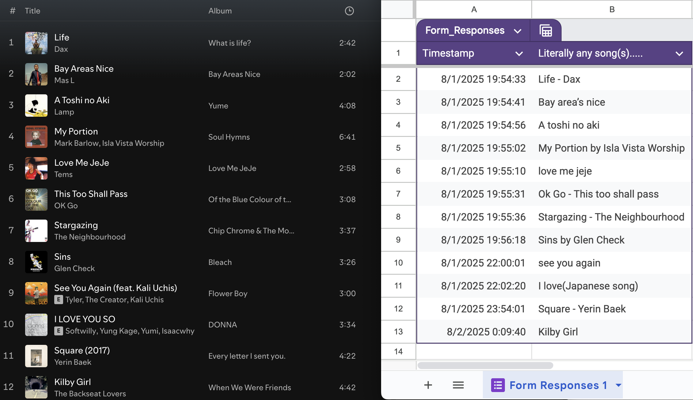

# form2playlist

Form2Playlist is a Google Apps Script project that connects a Google Form to a Spotify playlist. When someone submits a song, it automatically searches Spotify and adds the best-matching track to your playlist.

This tool was originally built for a presentation night to collect real-time song recommendations from guests. While designed for that single event, it has the potential to be expanded and adapted for other group settings in the future.

### Preview/Live Demonstration

Try out the live Google Form to submit song requests and see them added to the Spotify playlist in real time:

[Submit a Song](https://forms.gle/ojhmsx7ERswxT1Sb7)  
[View the Spotify Playlist](https://open.spotify.com/playlist/7CW5Avc2YdXGHdcupQgXkn?si=de9d0b7428a04863)

### Setup Instructions
1. Create a Spotify Developer app to get your Client ID, Client Secret, and Redirect URI.
2. Create a Spotify playlist and get the Playlist ID (the part after playlist/ in the URL)
3. Open the Google Apps Script editor in the Google Sheet linked to your form.
4. Add auth.gs and main.gs files to your Apps Script project.
5. Run the auth.gs function in the Apps Script editor, then open the logged URL in your browser to get the authorization code.
6. Paste the authorization code into main.gs.
7. Set up a trigger in Apps Script to run addLatestSongsToPlaylist on form submission.

### Notes & Limitations
- This tool was originally designed for a single user and a specific event — expanding to support multiple users or playlists will require additional work.
- The Spotify authorization process requires manually running the auth script and pasting the code; fully automated OAuth flow is not implemented yet.
- Song matching depends on Spotify’s search API and may sometimes return imperfect results, especially with typos or uncommon formatting.
- The app assumes the playlist is owned by the authorized user; adding tracks to others’ playlists will cause permission errors.
- API rate limits may apply if many users submit songs rapidly in a short time frame.
